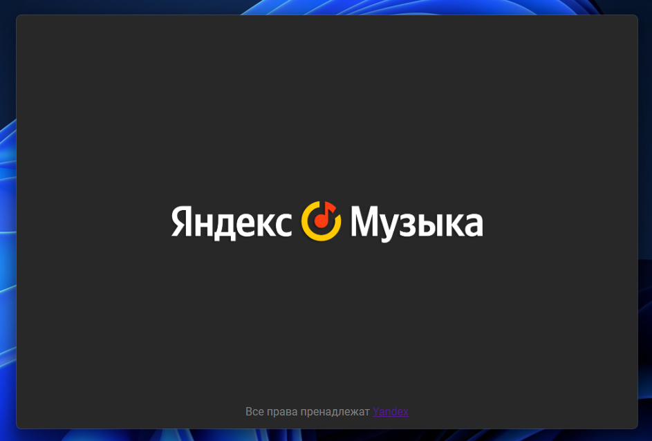
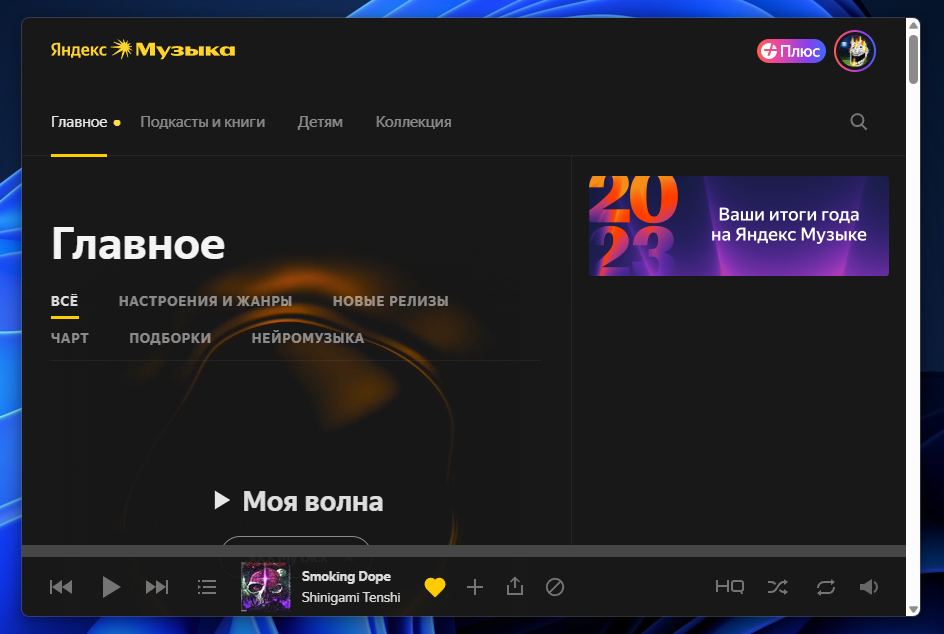

<h1 align="center">Yandex Music Custom Client</h1>

# Заархивировано, так как яндекс наконец-таки выпустил новый, охуенный клиент для пк :)

<div>


</div>

Эта штука больше подходит для русскоязычной аудитории, так штооооо README я буду писать на русском :)

В краце, это веб версия сайта music.yandex.com которую я сделал в замен клиенту яндекс музыки на винде.
YMCC крут, потому что:
* Сделан на Rust
* Построен на Tauri => имеет высокую производительность, кроссплатформенность, и малый размер.
* Можно свернуть в системный трей

Вообще, YMCC жрёт больше ресурсов чем обычный клиент яндекс музыки.
* YMCC: +-203mb ram
* Yandex Music: +-105mb ram
Но тут конечно во всём виноват веб, и т.п. брр скибиди.

### TODO:
* Сделать возможность перетаскивать окна
* Добавить Discord Rich Presence

Build:

```
cargo install create-tauri-app --locked
cargo create-tauri-app # выбираем js; npm; typescript

npm run tauri dev # дев билд
```
